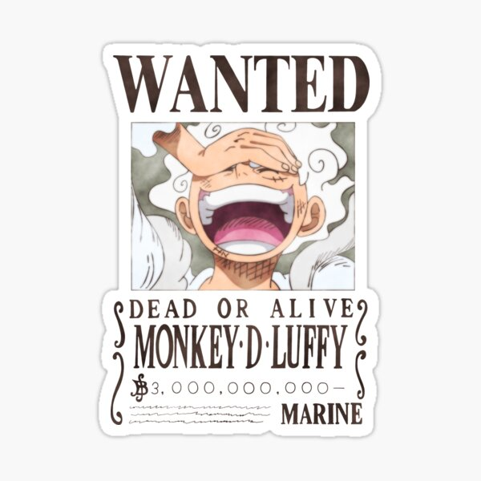

	
	 

# A collection of tools to generate curd code

The core of these tools are parsing the resouce query language to ent ORM to operate curd on database.

cbc will generate the core layer to parse the the resouce query language to ent ORM 

cb_kratos will generate microsservice based on kratos framwork and use cbc layer to curd
